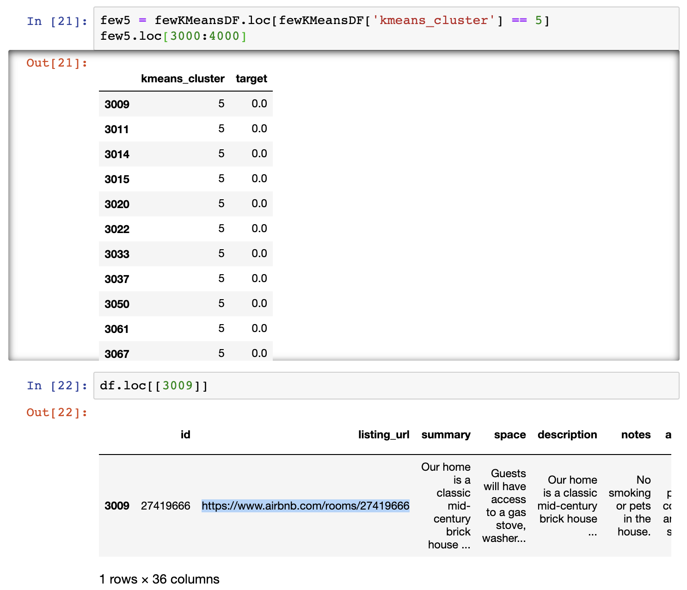

## Airbnb in Denver: Finding the Criminal Clusters
### Sarah Forward

Building upon my [first capstone](https://github.com/sbpforward/Airbnb-in-Denver) where I conducted an initial exploratory data analysis, I decided to continue the search to determine whether or not I could predict a particular Airbnb listing was in violation of [Denver's Short-Term Rental license](https://www.denvergov.org/content/denvergov/en/denver-business-licensing-center/business-licenses/short-term-rentals/short-term-rental-faq.html).

Quick review: To obtain a Short-Term Rental license in Denver...

+ You must be a legal resident of the United States.
+ **The property must be your primary residence.**
+ **If the property is owned by an LLC, the applicant must be the owner of that of that entity.**
+ If the property is leased, a copy of the lease with the landlord's approval to use the property as a short-term rental
+ Must have some kind of Colorado State approved ID w/ the address along with vehicle regristration, tax documents, or utility bill — all with the same, Colorado address. 
+ You must possess all applicable Business Tax licenses, including the Lodger’s Tax.
+ Tax License Application
+ Check with your insurance carrier to ensure that your STR is covered.

The Data
------
I found my data from [Inside Airbnb](http://insideairbnb.com/about.html). It's owner and moderator, Murray Cox, is an Austrailian-native-turned-New-York-transplant who runs the independent, non-commercial site as a tool to help discover "how Airbnb is really being used in cities around the world."

He's been scraping publicly available data on Airbnb from more than 100 cities around the world. You can get listings, calendar dates and availability, and reviews for cities like Amsterdam, Barcelona, Cape Town, Hong Kong, and, of course, Denver.

There are 4,511 listings and 106 rows in the original dataset. I kept columns that I believed to be most relevant about the listing and the host.

From Unsupervised to Semi-Supervised
------
The dataset does not come with a column that states "Yes" or "No" if the listing is in violation, so I found 100 listings that I understood to be violation Denver's terms. Since I don't have access to legal paperwork, I searched "Host Location" for cities that were **NOT** in Denver. Out of the 200 listings and host profiles I dug through, nearly half were in violation.

Here is a listing:

Here is the host's profile:

------

Based on my search, I identified 4 kinds of people who are in violation based on their "Host Location". They are...
1. A vacation home rental managment persons/companies.

2. Within some kind of driving distance to Denver:
   + Cities like Lakewood or Aurora as "Greater Denver Area", but actually in neighboring counties such as Jefferson, Adams, Arapahoe, or Boulder.
   + Neighboring front range major cities such as Fort Collins and Colorado Springs.
   + Mountain dwellers that live in Aspen, Vail, or Breckenridge. 

3. People that don't even live in the same state or country!

   + Discovered 166 total listed cities, 21 of which are not in the United States. There are Denver hosts located in Gibraltar, Spain, United Kingdom, Vietnam, Isreal, Austrailia!

4. People who leave their location very broad by entering "Colorado" or "United States" and sometimes nothing at all.

-----

## SEE IF I CAN DO A WORLD MAP WITH GEOPANDAS ##

Cleaning the Data
------
+ Listing ID & URL
+ Host ID & Location
+ Host About 
+ Total listings the host has and by type of place
    + Entire home/apt
    + Private room
    + Shared room
+ Details like room type, number of rooms throughout the house
+ Pricing
   + Must have a daily rate, but not all homes set special weekly or monthly rates. 
+ Hot Encoded the following — 1: Yes // 0: No
   + Host location
   + Host Superhost
   + Listing location in Denver?
        + Englewood
        + Lakewood
        + Wheat Ridge
        + Aurora
        + Littleton
        + Stapleton
    + Requires license?
        + Campers/RVs do not
    + If required, is their license information listed AND current?

PCA
-----

Wanting to get a better sense of my data structure and to see what features might be collinear, I used pricncipal component analysis. 

- Taking 36 rows of data and making it a 2-D plot
- Line fits the Data and the PCA projects data onto it, then measure the distances from the data to the line and try to find the line that minimizes the distnce, or maximizes the distance from the projected points to the origin
- Goal is to get the line with the largest sum of squared distances
- Each line is called te eigenvector for that PC  
- the proportion of each listing 

KMeans Model
-----

Evaluating the Model
-----
With KMeans, you'd usually check the model using an elbow plot or silhouette score.

Analysis (e.g cleaning pipeline, modeling, validation of model, presentation of results)	
0: None
1: Approach invalid/unsuited to problem.
2: Brief description focused on results without any explanation of approach/method.
3: Clearly explained process that my be slightly incomplete or with minor errors.
4: Clearly explained with no/few errors.
5: Impressive effort.

README	
0: Missing or useless in describing project.
1: Misspellings, hard to read font, strange formatting, ugly screenshots, inconsistent text sizes, wall-of-text.
2: Generally pleasing that describes project well, good illustrations, a few minor issues.
3: Beautiful and an impressive showcase for the project with good organization, appropriate use of text and illustrations, and helpful references.f
